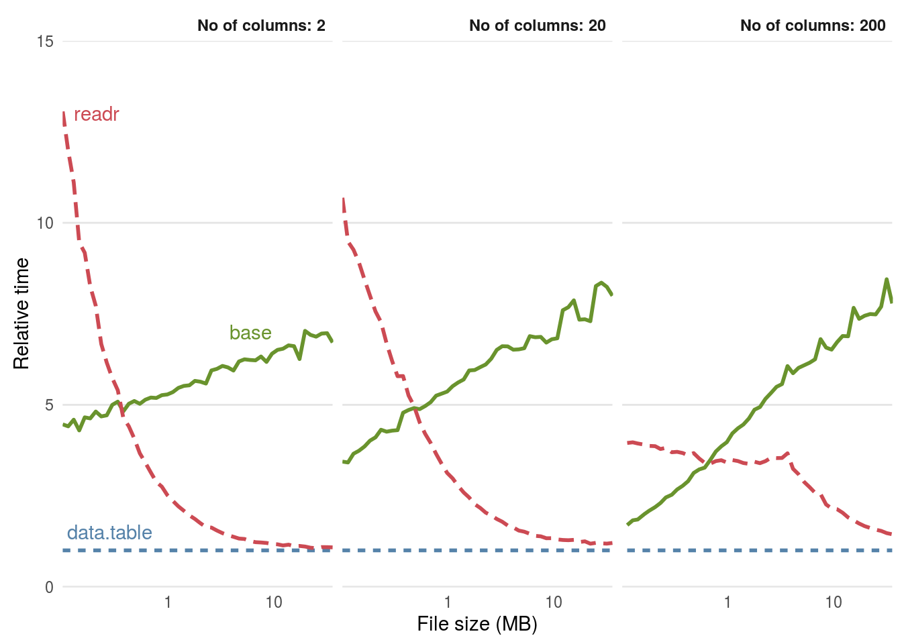
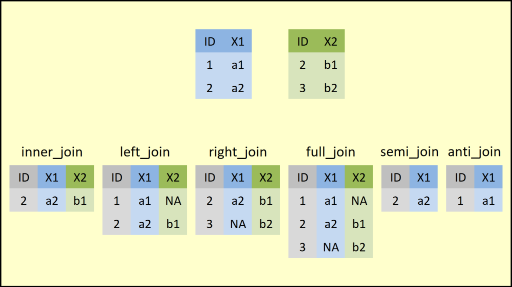

```{r setup, include=FALSE}
knitr::opts_chunk$set(echo = TRUE)
setwd("~/Documents/School/CBC/workshop_materials/2/")
```


# Getting Started

Within the R community, we observe that there are multiple code styles. Your code style will not matter as much if you are the only person analyzing the data, however, this becomes problematic if you work as a team along with other R programmers. To circumnavigate this issue, I will introduce a collection of packages (and philosophy) known as [Tidyverse](https://www.tidyverse.org) and its code-style developed by Tidyverse and Google. Furthermore, we will look at some of the ggplot functions to visualize your data.

## Table of Contents
  1. Tidyverse Code Style
    a. Naming R script 
    b. Organizing script structure
    c. Syntax
    d. Pipes
      - Examples
  2 Data visualization with ggplot2
    a. Using custom color palettes

<br>

### 1. Tidyverse Code Style Guide

##### 1a. Naming R Script

File names should be meaningful, descriptive, yet concise. Avoid using special characters in file names and stick with letters, numbers, ```-```, and ```_```.

```
# good
fit_models.R
run_GWAS_analyses.R

# bad
analysis1.R
foo.R
```

If files should be run in a particular order, prefix them with numbers.

```
00_download_data.R
01_preprocess_data.R
02_analyze_data.R
03_plot_figures.R
```

##### 1b. Organizing Script Structure

Also, it is a good idea to use commented lines of ```-``` to break up your file to readable chunks. Also, it is a good practice to load all of the libraries at the beginning of your scripts rather than sprinkling them throughout the code.

```
# Loading the packages --------------------------
library(package1)
library(package2)

# Loading the data ------------------------------
codes_to_load_the_data()

# Modifying the loaded data ---------------------
modifying_the_loded_data()
```

##### 1c. Syntax

Every language has a different syntax style. Here, I will show you the Google's (which is Tidyverse's) syntax.

**Variable** and **function** names should use only **lowercase letters, numbers, and ** ```_```. Here, you might notice that all of the function names include ```_``` whereas some of the base ```R``` codes use ```.```. Long story short, you should reserve ```.``` for S3 object system. 

```
# Good
loaded_data
modified_data
final_data
preprocessing_data()

# Bad
loadedData
LoadedData
data1
modifiedfinaldata
func1()
preprocessing.data()
```

Generally variable names should be nouns and function names should be verbs.

###### Spacing

Always put a space after a comma just like in regular English.

```
# Good
data_frame[, 1]

# Bad
data_frame[,1]
data_frame[ ,1]
data_frame[ , 1]
```

###### Parentheses

Do not put spaces inside or outside parentheses for regular function calls.

```
# Good
mean(values, na.rm = TRUE)

# Bad
mean (values, na.rm = TRUE)
mean( values, na.rm = TRUE)
```

Place a space before and after ```()``` if it is used for ```if```, ```for```, or ```while```.

```
# Good
if (debug) {
  show(messages)
}

# Bad
if(value){
  show(messages)
}
```

###### Extra Spaces 

Adding extra spaces is okay if it improves alignment of ```=``` or ```<-```

```
value          <- 10
modified_value <- value + 20
```

###### Long lines

If a functional call is too long to fit on a single line, use one line each for the function name, each argument, and the closing.

```
# Good
do_something_very_long(something = "that", requires = many, arguemnts = "some of which may be long")

# Better
do_something_very_long(
  something = "that",
  requires = many,
  arguemnts = "some of which may be long"
)

# Bad
do_something_very_long("that", requires, many, arguments,
                       "which can be very long")
```

###### Assignment

One thing that is very different for R is that you have to use ```<-``` instead of ```=``` for assignment

```
# Good
x <- 5

# Bad
x = 5
```

##### 1d. Pipes

This is one of the reason on what makes ```Tidyverse``` really unique! It uses ```%>%``` to emphasize a sequence of actions, rather than the object that the actions are being performed on. 

You should use the pipe when:

1. You have multiple functions being done for a variable

You should avoid using the pipe when:

1. You need to manipulate more than one object at a time. 
2. There are meaningful intermediate objects that could be given informative names.

```
# Traditional R
result <- function1(function2(function3(function4(x))))

# or ....
processed_data    <- process_data(initial_data)
modified_data     <- modify_data(processed_data)
filtered_data     <- filter_data(modified_data)
result            <- produce_result(filtered_data)

# By running your code this way, you are creating unnecessary variables that will take up your R environment.
# Since R is heavily dependant on your RAM, more variables you have = slower the computation.
 
# Tidyverse R (Pipes)
result <- initial_data %>% 
  process_data() %>% 
  modify_data() %>% 
  filter_data() %>% 
  produce_result()
  
```

Instead of writing hard-to-read code and creating multiple unnecessary variables, you can utilize the pipes!

###### Long and Short Pipes

If the arguments to a function don't all fit on one line, put each argument on its own line and indent.

A one-step pipe can stay on one line. It is better to write it to a regular function call.

```
process_data(initial_data)
```

###### Whitespace

```%>%``` should always have a space before it and should usually be followed by a new line as shown above.

###### Assignment

There are three acceptable forms of assignment

```
# Good 
result <- initial_data %>% 
  process_data() %>% 
  modify_data() %>% 
  filter_data() %>% 
  produce_result()
  
result <- 
  initial_data %>% 
  process_data() %>% 
  modify_data() %>% 
  filter_data() %>% 
  produce_result()

# Okay
initial_data %>%
  process_data() %>%
  modify_data() %>%
  filter_data() %>%
  produce_result() ->
  result
```

Pick whatever makes more sense or looks good to you. 

#### Additional Resources

[Pipes Manual](https://magrittr.tidyverse.org/reference/pipe.html)

[Aliases Manual](https://magrittr.tidyverse.org/reference/aliases.html)

[Tidyverse Packages](https://www.tidyverse.org/packages/)

[Tidyverse Style Guide](https://style.tidyverse.org/files.html)

After writing all of your code, you can simply check your syntax by using ```styler``` package.

```{r, echo=FALSE}
setwd("./")
knitr::include_graphics("./files/tidyverse_styler_0.1.gif")
```

You can download this package by using either
```{r, eval = F}
# this
install.packages("styler")

# or this
remotes::install_github("r-lib/styler")
```

##### Examples

Let's look at a large environmental chemistry dataset. This example dataset was generated through chemical speciation analysis of smoke samples collected during lab-based simulations of wildfire events. Specifically, different biomass materials (eucalyptus, peat, pine, pine needles, and red oak) were burned under two combustion conditions of flaming and smoldering, resulting in the generation of 12 different smoke samples. These data have been previously published in the following example environmental health research studies, with data made publicly available:

+ Rager JE, Clark J, Eaves LA, Avula V, Niehoff NM, Kim YH, Jaspers I, Gilmour MI. Mixtures modeling identifies chemical inducers versus repressors of toxicity associated with wildfire smoke. Sci Total Environ. 2021 Jun 25;775:145759. doi: 10.1016/j.scitotenv.2021.145759. Epub 2021 Feb 10. PMID: [33611182](https://pubmed.ncbi.nlm.nih.gov/33611182/).

+ Kim YH, Warren SH, Krantz QT, King C, Jaskot R, Preston WT, George BJ, Hays MD, Landis MS, Higuchi M, DeMarini DM, Gilmour MI. Mutagenicity and Lung Toxicity of Smoldering vs. Flaming Emissions from Various Biomass Fuels: Implications for Health Effects from Wildland Fires. Environ Health Perspect. 2018 Jan 24;126(1):017011. doi: 10.1289/EHP2200. PMID: [29373863](https://pubmed.ncbi.nlm.nih.gov/29373863/).

```{r, echo = FALSE, message = FALSE}
library(data.table)
library(tidyverse)
library(magrittr)
library(reshape2)

sample_data <- fread("./files/tidyverse_data_for_visualizations.csv")
```

##### Reading in file.

Probably many of you use ```read.table``` or ```read.csv``` to read in your file. This might not matter for many of you since reading in a small file does not take that long, but if you want to read a file that is in 100s of MBs of even multiple GBs, I suggest using ```fread()``` Why?

```{r, echo=FALSE} 

```

```{r, using pull and group_by}
# Let's look at each columns and conduct basic analysis
# One of the way we can extract a data from a specific column is to use pull() function from tidyverse
# Here we can see that there are multiple chemical types. 
sample_data %>%
  pull(`Chemical Category`)

# You can also use unique() function afterwards to see unique categories
sample_data %>% 
  pull(`Chemical Category`) %>%
  unique()

# Using the table can tell you the # of each chemical type
sample_data %>% 
  pull(`Chemical Category`) %>%
  table()

# Or... you can also do this!
# group_by() takes an existing data and converts it into a grouped data where operations are performed "by group"
sample_data %>%
  group_by(`Chemical Category`) %>%
  tally() %>%
  arrange(desc(n))
```

```{r, using dplyr functions}
# In certain cases, you might need to subset your data by picking few of the columns.
# For this case, let's make a data subset.
# You can use select() function to select few columns.
# Also, you can use magrittr's set_colnames() function to rename the columns
data_subset <- sample_data %>%
  select(`Chemical Category`, Eucalyptus_Smoldering, Eucalyptus_Flaming) %>%
  set_colnames(c("category", "smoldering", "flaming"))

head(data_subset)

# Also, you can subset this data further by using filter() function
data_subset %>%
  filter(flaming > 0.2) %>%
  head()

# Or, we can make a new column by using a mutate() function.
data_subset <-
  data_subset %>%
  mutate(above_threshold = ifelse(smoldering > 0.2 & flaming > 0.2, TRUE, FALSE))

# Making a new subset data
data_above_threshold <-
  data_subset %>%
  filter(above_threshold == TRUE)

# and do some analysis
data_above_threshold %>%
  group_by(category) %>%
  summarize(
    min = min(smoldering),
    q1 = quantile(smoldering, 0.25),
    median = median(smoldering),
    mean = mean(smoldering),
    q3 = quantile(smoldering, 0.75),
    max = max(smoldering)
  )

data_above_threshold %>%
  group_by(category) %>%
  summarize(
    min = min(flaming),
    q1 = quantile(flaming, 0.25),
    median = median(flaming),
    mean = mean(flaming),
    q3 = quantile(flaming, 0.75),
    max = max(flaming)
  )

# By comparing these two together, we can see which chemical category has both 
# eucalpytus smoldering and flaming values that are larger than 0.2
sample_data %>%
  group_by(`Chemical Category`) %>%
  tally() %>%
  arrange(desc(n))

data_above_threshold %>%
  group_by(category) %>%
  tally() %>%
  arrange(desc(n))
```

##### 2. ggplot2

It is safe to assume that almost all of you know how to use ggplot. However, if you have never used ggplot, you can think of [ggplot](https://ggplot2.tidyverse.org/) as a "prettier" version of base R plots.


```{r, warning = F}
library(MetBrewer)
# Let's melt the data so that we can visualize
# Melting simply makes the data longer take a look at what this function does.

# Previously... 
head(sample_data)

# With melt
sample_data_melt <- melt(sample_data, variable = "measurement_type")
head(sample_data_melt)

ggplot(sample_data_melt, aes(x = `Chemical Category`, y = value, fill = measurement_type)) +
  geom_boxplot()

inorganic_data_melt <-
  sample_data_melt %>% 
  filter(`Chemical Category` == "Inorganics") 

ggplot(inorganic_data_melt, aes(x = `Chemical Category`, y = value, fill = measurement_type)) +
  geom_boxplot()

# Using "pretty" colors
ggplot(inorganic_data_melt, aes(x = `Chemical Category`, y = value, fill = measurement_type)) +
  geom_boxplot() +
  scale_fill_manual(values = met.brewer("Hiroshige", 10))

```


##### ggplot examples

[Top 50 ggplot2 Visualizations](http://r-statistics.co/Top50-Ggplot2-Visualizations-MasterList-R-Code.html)

[R-graph gallery](https://www.r-graph-gallery.com/ggplot2-package.html)

##### Other color palette options

[MetBrewer (Current)](https://github.com/BlakeRMills/MetBrewer/tree/main)

[WesAnderson](https://github.com/karthik/wesanderson)

[PNWColors](https://github.com/jakelawlor/PNWColors)


##### Other useful tidyverse functions

```{r, echo=FALSE}

```

Read more about it here: [Joining Data Frames together (SQL Style)](https://statisticsglobe.com/r-dplyr-join-inner-left-right-full-semi-anti)

```{r, echo=FALSE}
knitr::include_graphics("./files/tidyverse_reticulate.png")
```

Running python on R markdown: [Reticulate](https://rstudio.github.io/reticulate/)

[Reticulate Cheat Sheet](https://raw.githubusercontent.com/rstudio/cheatsheets/main/reticulate.pdf)