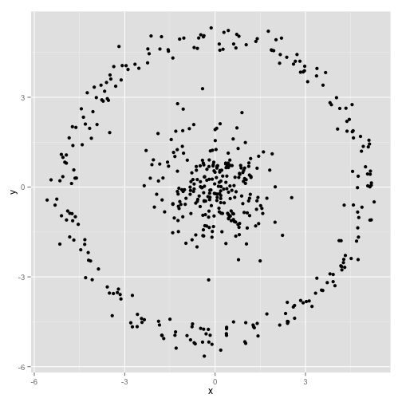
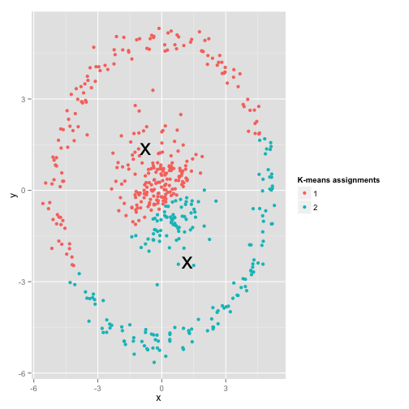

Loading the relevant libraries
```{r message=FALSE, warning=FALSE}
library(tidyverse)
library(reticulate)
```


# Clustering Overview

Once the data has been reduced to a few lower dimensions, we might want to separate the data points into group, with each group containing members that are more similar to each other than to those in other groups. There are two main types of clustering: supervised and unsupervised. In supervised clustering, we use data that has already been divided into cluster to train our model, and then apply the model to new data. This is useful if we already know how the datapoints cluster along our measured variables. In unsupervised clustering, we let an untrained model infer similarity from the data points only. The latter case is especially useful following dimensionality reduction since the resulting reduced dimensions are often not easily interpretable. For instance, PCA components are linear combinations of the original features of the data. We will use a few unsupervised clustering methods on the dataset following dimensionality reduction and see whether the clusters correspond to something meaningful in the data. It is important to understand the set of assumptions made by each clustering algorithm, since deviations from assumptions can result in improper clustering.


## K-means clustering

In this type of clustering, the model partitions our data set into a specified number of clusters k (also known as centroids) while minimizing the squared Euclidean distance (also known as the variance) within each cluster. Intuitively, and in the case of two dimensions, this means our clusters will contain points that are closesr to each other on the graph than to other points. The algorithm works by choosing random centroids and then iteratively calculating better placement for this centroids which minimized the variance within each centroid. The process halts when it has reached stable centroid positions or when a set number of iterations has been reached, whichever happens first. 

### K-means assumptions
* That the clusters are spherical.

* That points whithin the cluster have roughly equal variance resulting from a mixture of gaussian distributions 

(K-means also tends to produce clusters that are roughly equal in size)




(Images from: [K-means clustering is not a free lunch](http://varianceexplained.org/r/kmeans-free-lunch/))

### K-means clustering in R

We will try clustering the data we worked with previously after reducing dimensionality using PCA.

We will load the data, and then do a PCA on all but the text columns

```{r}
data <- read.csv('../data/woodfire_data.csv', fileEncoding="UTF-8-BOM")
pca <- prcomp(data %>% select(-c(1:3,ncol(data))))
summary(pca)
```
We can see that the first two components capture just over 90% of the variation in the data. That is good news, since it means that subsequent anaylses using those two components does not risk losing too much information about the data. Let's plot the first two components:

```{r}
results_two_dim <-
  pca$x %>% as_tibble() %>% select(PC1, PC2)
ggplot(data=results_two_dim, mapping=aes(x=PC1, y=PC2)) + 
  geom_point() +
  geom_jitter(width=0, height=0.2)
```

We can now try K-means clustering with k equal to the number of chemical categories

```{r}
k <- 
  data %>% 
  select(Chemical.Category) %>% 
  unique() %>% 
  count() %>% 
  pull()
clustering = kmeans(results_two_dim, k, iter.max = 50)
clustering$cluster
```
This cluster vector is in the same order as our points in the dataset. Let's add the it as a column to the two dimensional data and then color by cluster.

```{r}
two_dim_cluster <-
  results_two_dim %>% 
  mutate(cluster = factor(clustering$cluster, levels=c(1:k)))

ggplot(data=two_dim_cluster, mapping=aes(x=PC1, y=PC2, color=cluster)) +
  geom_point()
```

Let's see if these clusters correspond at all to something like chemical category

```{r}
two_dim_cluster$chemical.category <- data$Chemical.Category
ggplot(two_dim_cluster, mapping = aes(x=cluster, y=chemical.category)) +
  geom_point() +
  geom_jitter(width=0, height=0.2)
```

This isn't great, as most points seem to be in one cluster and is no good separation of categories.

Let's see if taking components 2 and 3 changes the clustering

```{r}
pca_other_comps <-
  pca$x %>% 
  as_tibble() %>% 
  select(PC2, PC3)

clustering = kmeans(pca_other_comps, k, iter.max = 50)

two_dim_cluster <-
  pca_other_comps %>% 
  mutate(cluster = factor(clustering$cluster))

ggplot(data=two_dim_cluster, mapping=aes(x=PC2, y=PC3, color=cluster)) +
  geom_point()

two_dim_cluster$chemical.category <- data$Chemical.Category
ggplot(two_dim_cluster, mapping = aes(x=cluster, y=chemical.category)) +
  geom_point() +
  geom_jitter(width=0, height=0.2)
```

Not much better. We can also try a different dimensionality clustering technique, such as spectral clustering. 

## Spectral Clustering

This form of clustering relies on graph theory, treating each data point as a node on the graph and assembling edges that connect these notes based on some measure of similarity (such as Eucledian distance or nearest neighbor) and then dividing the graph into separate communities. The neat thing about this method is that it does not make the same assumptions as k-means clustering and is thus better suited for data that may not be spherical or that may not exhibit mixture-of-gaussian variation. We will use the excellent python package `sklearn` here for this clustering.

```{r}
cluster <- import("sklearn.cluster");

sc <- cluster$SpectralClustering(n_clusters=as.integer(k),
                                 affinity="nearest_neighbors");

data_spectral <- sc$fit(results_two_dim)

spectral_cluster <-
  results_two_dim %>% 
  mutate(cluster = factor(data_spectral$labels_))

ggplot(data=spectral_cluster, mapping=aes(x=PC1, y=PC2, color=cluster)) +
  geom_point()

spectral_cluster$chemical.category <- data$Chemical.Category

ggplot(spectral_cluster, mapping = aes(x=cluster, y=chemical.category)) +
  geom_point() +
  geom_jitter(width=0, height=0.2)
```

Results here are better, although still not entirely great.

We also can try spectral clustering with PHATE. Due to the way PHATE works, we would not cluster directly on the resulting two phate dimensions, since these are used mostly for visualization of data. Instead we can carry out k-means on the PHATE operator, which is equivalent to spectral clustering. The `phate` python package has a direct implementation of this clustering. 

Unlike the last time we used PHATE, we will be using the R library `reticulate` which allows us to call Python methods and packages as long as we have a working Python installation on our system and the necessary Python packages installed.

```{r, message=FALSE, warning=FALSE, fig.width=10}
phate <- import('phate')
phate_op <- phate$PHATE()
data_phate <- phate_op$fit_transform(data %>% select(-c(1:3,ncol(data))))
phate_clusters <- phate$cluster$kmeans(`phate_op`, k)

data_phate_cluster <-
  as_tibble(data_phate) %>% 
  mutate(cluster = factor(phate_clusters))

ggplot(data=data_phate_cluster, mapping=aes(x=V1, y=V2, 
                                            color=cluster)) +
  geom_point()

data_phate_cluster$chemical.category <- data$Chemical.Category

ggplot(data_phate_cluster, mapping = aes(x=cluster, y=chemical.category)) +
  geom_point() +
  geom_jitter(width=0, height=0.2)

```

This looks quite a bit different, and much better. Which chemical categories are clustering well? Can we try other combinations of dimensionality reduction and clustering methods?


